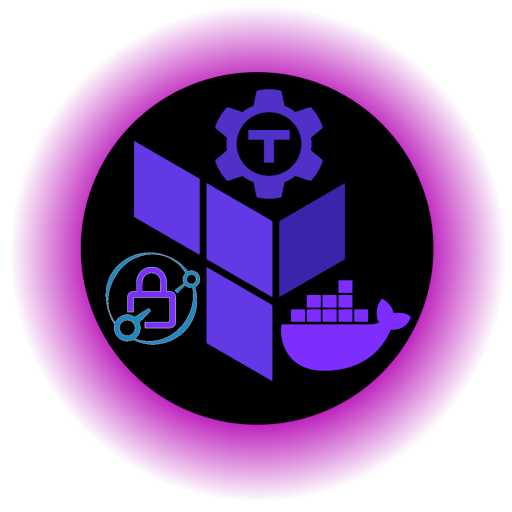

# Teleport-Openstack-Caddy

<div align="center">
  
  <h1>
    <span style="color:#4A6EE0">Teleport</span>
    - Openstack -
    <span style="color:#7D2EFF">Caddy</span>
  </h1>
  <h4>Deploy easily a Teleport instance behind a reverse proxy.</h4>
  <p align="center">
    <a href="https://github.com/GridexX/teleport-openstack-caddy"></a>
    <a href="https://github.com/GridexX/teleport-openstack-caddy"></a>
  </p>
</div>

This repository contains the Dockerfile and the necessary files to provision a Debian VM with Terraform into Openstack, install Teleport and Caddy, and configure the latter to act as a reverse proxy for the former.

## Requirements:

- Cloudflare account
- Openstack cluster
- Terraform CLI

## Installation and usage

Clone the repository and navigate to the `terraform` directory. Edit the `variables.tf` file to match your environment.
Here are the commands to run:

```bash
git clone https://github.com/GridexX/teleport-openstack-caddy
cd ./teleport-openstack-caddy/terraform

# Edit the variables in the `variables.tf` file
terraform init
terraform plan
terraform apply
```

## Configuration

### Create the DNS records

Once the VM is provisioned, you need to configure the `docker-compose.yml` file with the Teleport URL and the Cloudflare API token.

First, retrieve the floating IP address with the following command:

```bash
terraform output -json | jq '.instance_fip_address.value' | sed -e 's/"//g'
```

Inside Cloudflare, create the DNS record for the Teleport instance.
>[!NOTE]
>Teleport use the wildcard DNS record `*.example.com` to create subdomains for each user. So you need to create a wildcard DNS record for the domain name you want to use. Also, you need to create a DNS record for the Teleport instance itself.

### Create the Cloudflare API token

We will link the Openstack VM to a Cloudflare DNS record, so we need to create a Cloudflare API token with the following permissions:

- Zone > DNS > Edit
- Zone Resources > Specific Zone > `example.com`
- Client IP Address Filtering is In <IP>

Once created, save the API token in a variable called `CLOUDFLARE_API_TOKEN`.
Connect into the VM with SSH and run the following commands:

```bash
cd ~/compose-teleport
export TELEPORT_URL="your-teleport-url"
envsubst < tmp-docker-compose.yml > docker-compose.yml
export CLOUDFLARE_API_TOKEN="your-api-token"
```

>[!IMPORTANT]
> Replace `your-api-token` with the Cloudflare API token and `your-teleport-url` with the URL of the Teleport instance. The exportation of the Cloudflare api token is done after the `envsubst` command to avoid saving it in the `docker-compose.yml` file.

This repository use a custom Caddy image with the [Cloudflare DNS plugin](https://github.com/caddy-dns/cloudflare). Also, it uses the [Docker-proxy](https://github.com/lucaslorentz/caddy-docker-proxy) to allows configuring Caddy from the labels of the Docker containers.

You can modify the Docker Image to match your needs.

## Launch the Docker containers

Once the `docker-compose.yml` file is created, run the following command to start the Caddy and Teleport containers:

```bash
docker-compose up -d
```

## Access the Teleport web interface

The Teleport web interface is now accessible at `https://teleport.example.com`. Replace `example.com` with your domain name.

## License

This project is licensed under the MIT License - see the [LICENSE](./LICENSE) file for details.

## Author

Made by [GridexX](https://github.com/GridexX) during February 2024 🏰

## References

- [Teleport behind Caddy reverse as a reverse proxy](https://github.com/gravitational/teleport/discussions/16370)
- [Cloudflare DNS plugin](https://github.com/caddy-dns/cloudflare)
- [Docker-proxy](https://github.com/lucaslorentz/caddy-docker-proxy)
- [Executer Teleport dans Docker](https://fr.linux-console.net/?p=20492)